<!--
## Hi there 👋
**vaibhavsijaria/vaibhavsijaria** is a ✨ _special_ ✨ repository because its `README.md` (this file) appears on your GitHub profile.

Here are some ideas to get you started:

- 🔭 I’m currently working on ...
- 🌱 I’m currently learning ...
- 👯 I’m looking to collaborate on ...
- 🤔 I’m looking for help with ...
- 💬 Ask me about ...
- 📫 How to reach me: ...
- 😄 Pronouns: ...
- ⚡ Fun fact: ...
-->

👋 Hi, I’m Vaibhav.

- 🔭 I’m currently working on Backend Development and System Programming.
- 🌱 I’m currently learning Rust, Zig, Game dev and MLOps.
- 💬 Ask me about anything!
- 😄 Pronouns: [he/him/his](https://en.wikipedia.org/wiki/He_(pronoun))
- 📫 How to reach me: [Email](mailto:vaibhav@sophic.dev) / [Telegram](https://t.me/CausalHermit) 
- ⚡ Fun fact: Still finding.

  

<!--

   
 
 

-->

  <table>
    <tr>
      <td>
        
      </td>
      <td>
        
      </td>
    </tr>
  </table>

